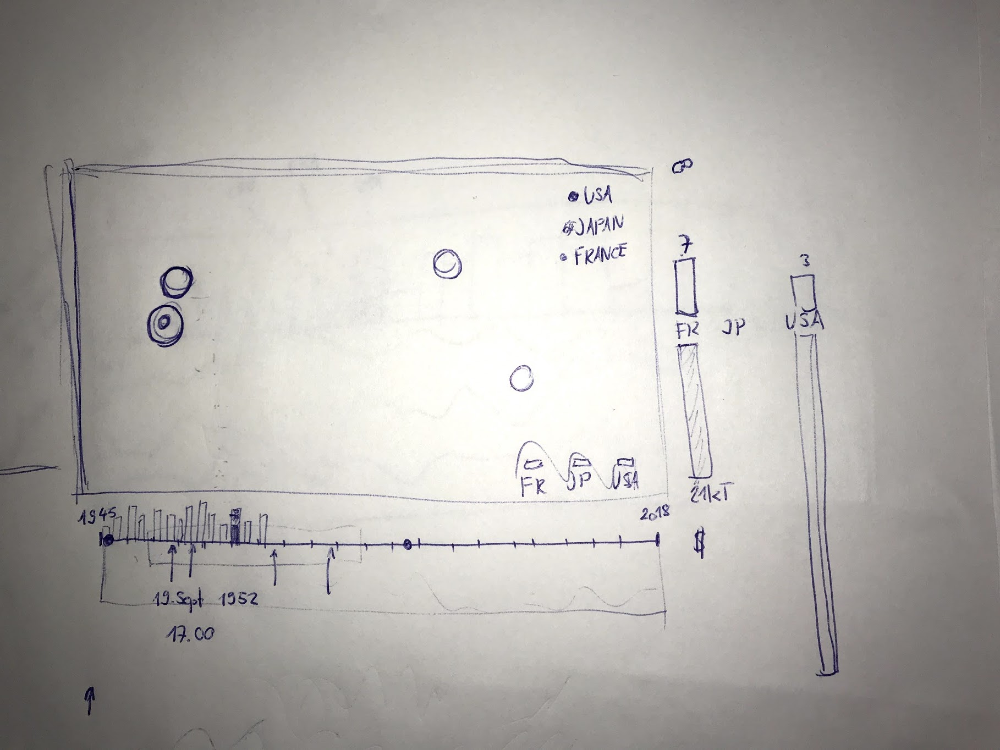
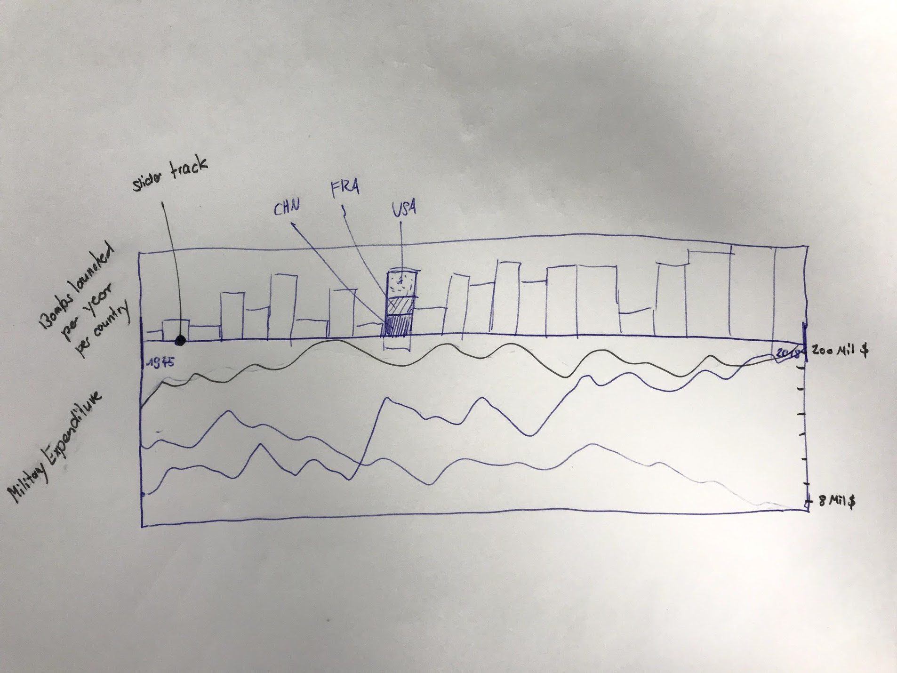

# NUKE
NUKE ist ein Visualisierungs-Projekt für die FHNW.

Link zur fertigen Applikation: [ivis-nuke.herokuapp.com](http://ivis-nuke.herokuapp.com/)

# Goal
Zeitraffer über die verschiedenen nuklearen Explosionen seit 1945.
Dargestellt auf einer Weltkarte.
Der Zeitpunkt kann über einen Slider eingestellt,
oder automatisch abgespielt werden.
Die Fläche des Indikators ist abhängig von der Sprengkraft der Bombe.
Die Länder sollen visuell erkennbar gemacht werden.

Falls genügend Zeit:
- Zoom Funktion auf das Geschehen
- Länder Filter
- Bar Chart zum Mengenvergleich der Bomben pro Land
- Nukleare Hintergrundstrahulng über Zeit anzeigen

# Datasources
- Atombobentests: [Nuclear Tests](http://www.johnstonsarchive.net/nuclear/tests/) & [Nuclear Notebook](https://fas.org/issues/nuclear-weapons/nuclear-notebook/)
- Militärausgaben: [Correlates of War Project](http://cow.dss.ucdavis.edu/data-sets/national-material-capabilities)

# API Documentation

## Nuke Dataset

``` javascript
[
  {
    time: 1523361684246, // Timestamp
    country: "USA", // Maps to a enumeration [USA, RUS, GBR, FRA, CHN, IND, PAK, PRK] in iso country codes
    latitude: "20.77000", // Needs to be converted to y-coordinates
    longitude: "55.00000", // Needs to be converted to x-coordinates
    yield: 23, // In kilotons
  }
]
```

## National Material

``` javascript
[
  {
    country: "USA", // Maps to a enumeration [USA, RUS, GBR, FRA, CHN, IND, PAK, PRK] in iso country codes
    year: 2003,
    militaryExpenditures: 265480000, // thousends in USD
    militaryPersonnel: 2269 // thousands
    energyConsumption: 2468629 // thousands of coal-ton equivalents
    population: 240651 // thousends
  }
]
```

## Overall draft



## Detailed Slider draft




# Features
- Automatischer Zeitraffer über die nuklearen Explosionen seit 1945.
- Histogram über die Anzahl Atombomben pro Jahr pro Land
- Militärausgaben im Vergleich zur Anzahl Atombomben pro Jahr pro Land

# Prerequisite

 * node@9.9.0
 * yarn@1.3.2
 * Editor with eslint support (recommended)

# Getting started

Install dependencies using yarn:

``` bash
yarn
```

Run app using webpack devserver:

``` bash
yarn serve
```

This will open a server on `localhot:8080` by default running the application.

Build application for production:

``` bash
yarn build
```

This will create a `index.html`, `main.css`, `main.js` file which can be served
over a web server in production.

# Usage
Um den Zeitraffer zu beginnen oder zu unterbrechen, kann man einfach auf das Atomsymbol im oberen linken Ecken drücken.

# Reflection
Nach einer raschen Ideenfindung waren wir motiviert mit unsere NUKE Visualisierung zu beginnen. Sogleich haben wir das Projekt Agreement ausgefüllt und mit der Datensuche begonnen. Es dauerte eine Weile, bis wir endlich eine einigermassen vernünftige Datenquelle gefunden haben. Jedoch war die Datenqualität unvollständig und nicht formatiert. Mithilfe von einer zweiten Datenquelle und der Trifacta Wrangler Applikation, konnten wir aber die Daten in angemessener Zeit komplettieren und in unserem Wunschformat (JSON) exportieren.

Nun begann der spannende Teil. Gemeinsam haben wir Sketches und Schnittstellen erstellt, um eine erfolgreiche Teamarbeit zu gewährleisten.
Ausserdem haben wir uns für die gerade neu erschienene fünfte Version von `d3.js` entschieden. Wir denken, dass dies ein guter Entscheid war, obwohl der Anfang etwas nachschlage lastig war, da es für diese Version praktisch noch keine Beispiele gab. Dafür konnten wir aber von den Verbesserungen profitieren.

Für die Implementierung benötigten wir ziemlich viel Zeit. Es machte uns jedoch Spass die d3 Welt zu entdecken sowie unsere JavaScript Kenntnisse anzuwenden und zu erweitern.

Wir konnten zeitlich nicht ganz alle vorgenommenen Features umsetzten, trotzdem können wir sagen, dass unser Projekt ein voller Erfolg war. Wir sind mit dem Resultat sehr zufrieden und konnten im Bereich Informationsvisualisierung viele wertvolle Erkenntnisse mitnehmen.
