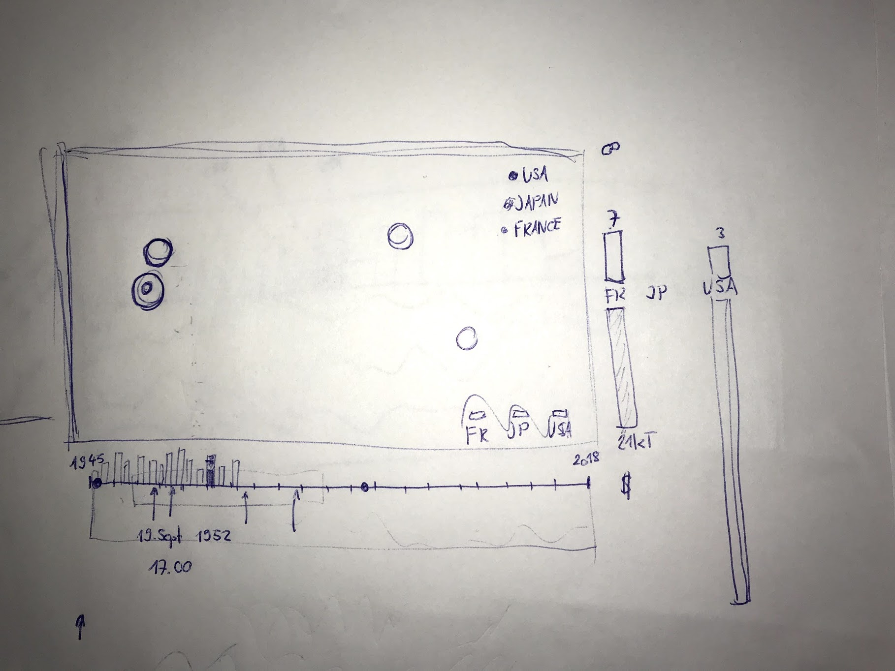
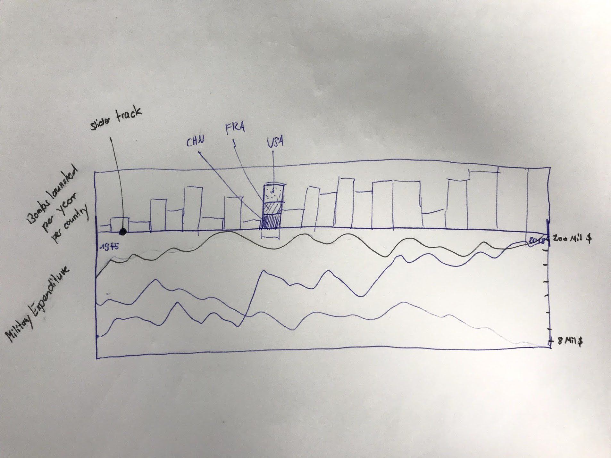

# API Documentation

## Nuke Dataset

``` javascript
[
  {
    time: 1523361684246, // Timestamp
    country: "USA", // Maps to a enumeration [USA, RUS, GBR, FRA, CHN, IND, PAK, PRK] in iso country codes
    latitude: "20.77000", // Needs to be converted to y-coordinates
    longitude: "55.00000", // Needs to be converted to x-coordinates
    yield: 23, // In kilotons
  }
]
```

## Military Expenses

``` javascript
[
  {
    country: "USA", // Maps to a enumeration [USA, RUS, GBR, FRA, CHN, IND, PAK, PRK] in iso country codes
    amount: 220000000000,
    year: 2003,
  }
]
```

## Overall draft



## Detailed Slider draft


